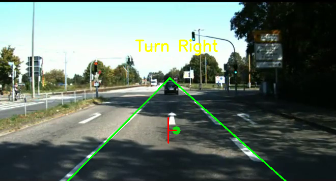
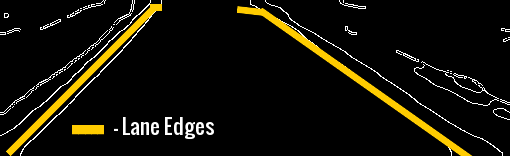

# Lane-Detection
This is the module for doing lane detection for DLive IIT Delhi. We have tested this on the zed_stereo_camera present on our car.

Dependencies:
[ROS CvBridge](http://wiki.ros.org/cv_bridge)

Steps to run the file: 
1) Make sure roscore is running

2) Run the ZED camera by the following command
   roslaunch zed_wrapper zed.launch
   
3) Run the python file via terminal by the following command
   python ZED3.py

For doing lane detection online, run the script ZED3.py. This subscribes to the /zed/rgb/image_rect_color topic so make sure your images are being published on this. If they are not you would have to change this topic in the script where the subscriber object is instantiated.

DETECTION OF THE LANES  

EDGE DETECTION USING CANNY FILTER  

PID STEERING CONTROL (Visualized by Turtle bot)  

